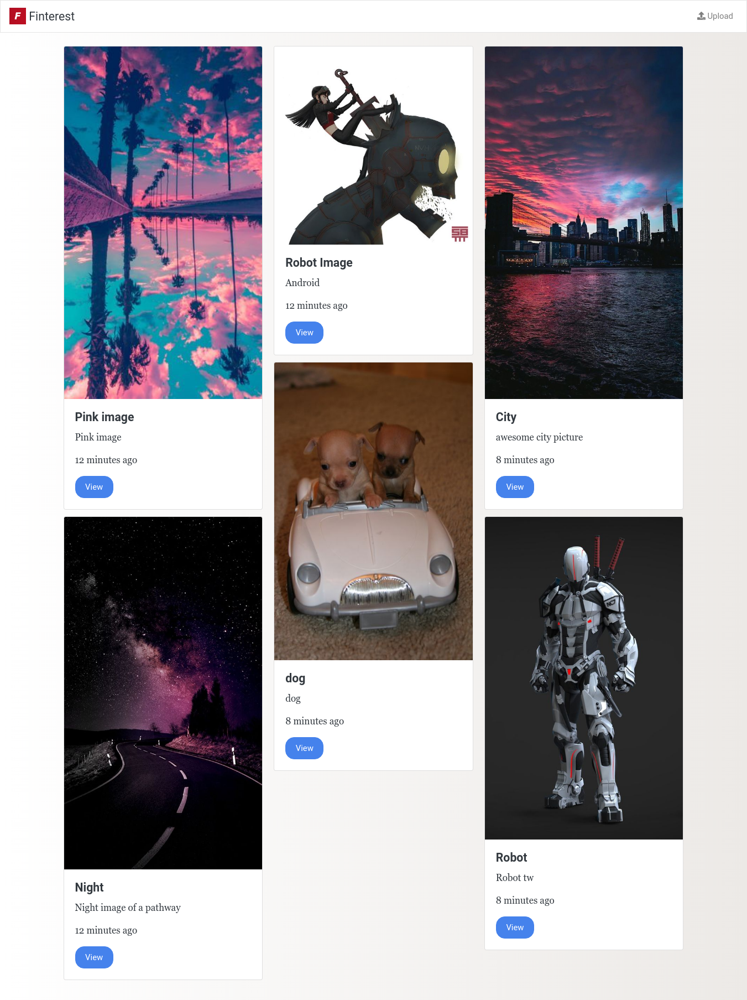

# Finterest
a simple example nodejs and mongodb app based on Pinterest.

################################################################################################

//para instalar

git clone https://github.com/FaztTech/nodejs-finterest.git

>> npm i express ejs fs-extra mongoose morgan multer timeago.js uuid

//para cargar

1. verficamos que mongo este desconectado
>> net staop MongoDB

2. arrancamos mongo desde el path, debo estar en una terminal como administrador.
>> mongod --dbpath "C:\Program Files\MongoDB\Server\5.0\data"

3. en una terminar diferente, no es necesario que estes como adminsitrador.
>> mongo

4. se corre el script del proyecto
>> npm run dev

5. se abre navegador
>> localhost:3000
